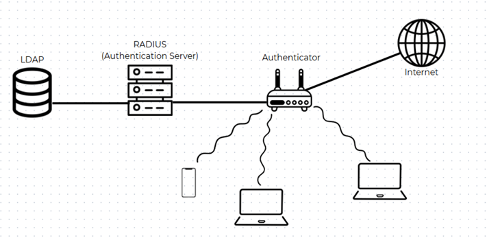

# Enterprise WLAN Authentication System (802.1X & RADIUS)

## 📌 Project Overview
This project demonstrates the deployment of a highly secure enterprise wireless network using **802.1X WPA2-Enterprise authentication**. Instead of relying on a shared Wi-Fi password (PSK), the system enforces centralized user authentication and authorization utilizing a **Windows Server 2019** infrastructure. 

By integrating Active Directory, RADIUS, and an Internal Certificate Authority, this project showcases a scalable and secure network architecture commonly used in corporate environments.

> **Note:** The original virtualized infrastructure has been decommissioned. This repository serves as the technical documentation and architectural overview of the deployment. For detailed step-by-step configurations and screenshots, please refer to the attached **[Full Technical Report (PDF) - Vietnamese](WLAN_8021X_Enterprise_Report.pdf)**.

## 🏗️ Architecture & Topology

### Core Components
* **Authentication Server (RADIUS):** Windows Server 2019 running **Network Policy Server (NPS)**.
* **Identity Management:** Active Directory Domain Services (**AD DS**) managing organizational units, security groups (e.g., IT, HR, Guest), and user credentials.
* **Public Key Infrastructure (PKI):** Active Directory Certificate Services (**AD CS**) acting as an Enterprise Root CA to issue digital certificates.
* **Authenticator:** **OpenWRT** Router/Access Point configured to forward EAP authentication requests.
* **Supplicant (Client):** Windows endpoints requesting network access.

## ⚙️ Technical Stack & Protocols
* **OS:** Windows Server 2019, OpenWRT, Windows 10/11
* **Protocols:** 802.1X, RADIUS, LDAP, PEAP (Protected EAP), MSCHAPv2
* **Encryption:** WPA2-Enterprise (AES-CCMP)

## 🚀 Implementation Workflow

Although the source configurations are no longer available, the system was successfully deployed following this strict administrative workflow:

### Phase 1: Identity & Access Management (AD DS)
1. Deployed Windows Server 2019 and configured static IP assignments.
2. Promoted the server to a Domain Controller (Forest root: `radius.local`).
3. Created logical Organizational Units (OUs) for Departments and established Security Groups with restricted scopes for Role-Based Access Control (RBAC).

### Phase 2: Public Key Infrastructure (AD CS)
1. Installed AD CS and configured it as an **Enterprise Root CA**.
2. Generated and issued a Server Authentication certificate (RSA 2048-bit, SHA256) for the NPS server to establish a secure TLS tunnel during authentication.
3. Exported the Root CA certificate (Base-64 encoded X.509) for client-side trust provisioning.

### Phase 3: RADIUS Server Configuration (NPS)
1. Installed Network Policy and Access Services (NPAS).
2. Registered the NPS server in Active Directory.
3. Added the OpenWRT router as a RADIUS Client with a strong shared secret.
4. Created Network Policies enforcing **PEAP-MSCHAPv2** authentication, explicitly validating users against specific AD Security Groups.

### Phase 4: Authenticator Setup (OpenWRT)
1. Configured the Wireless interface for **WPA2-EAP** (Strong Security) with AES-CCMP cipher.
2. Pointed the RADIUS Authentication Server to the Windows Server IP and applied the shared secret.

### Phase 5: Client Provisioning & Authentication
1. Adjusted Windows Server inbound firewall rules to allow authentication traffic from the client subnet.
2. Manually imported the exported Root CA certificate into the client's **Trusted Root Certification Authorities** store.
3. Configured the client Wi-Fi profile for WPA2-Enterprise and successfully authenticated using Active Directory credentials.

## 🛡️ Key Outcomes
* Eliminated the vulnerabilities of shared PSK Wi-Fi networks.
* Achieved centralized identity management and credential revocation.
* Secured the authentication payload using PEAP encrypted tunnels, mitigating credential interception risks.
